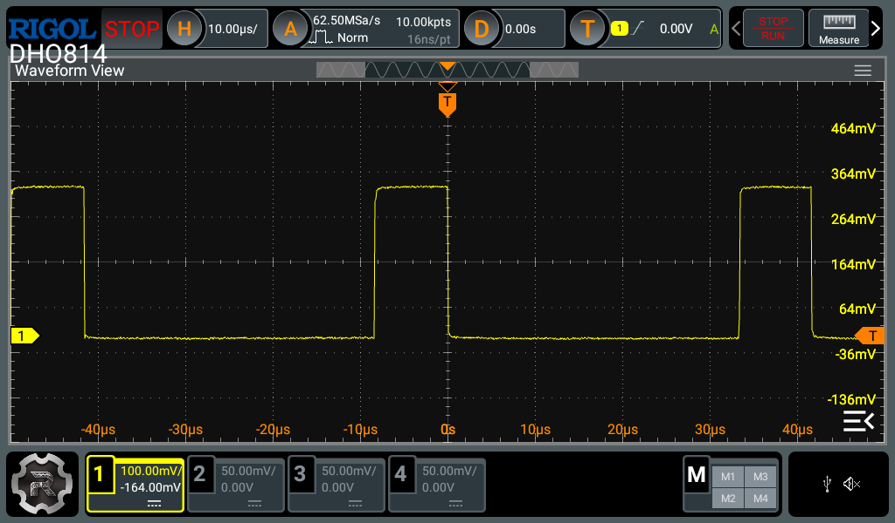
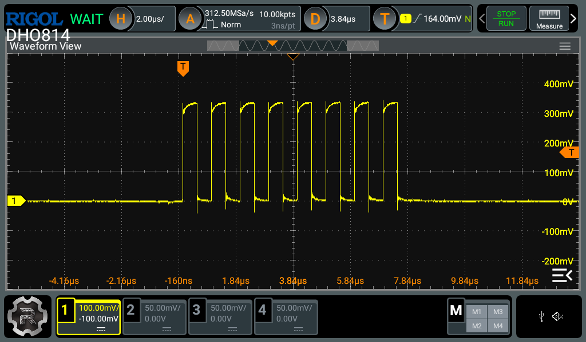
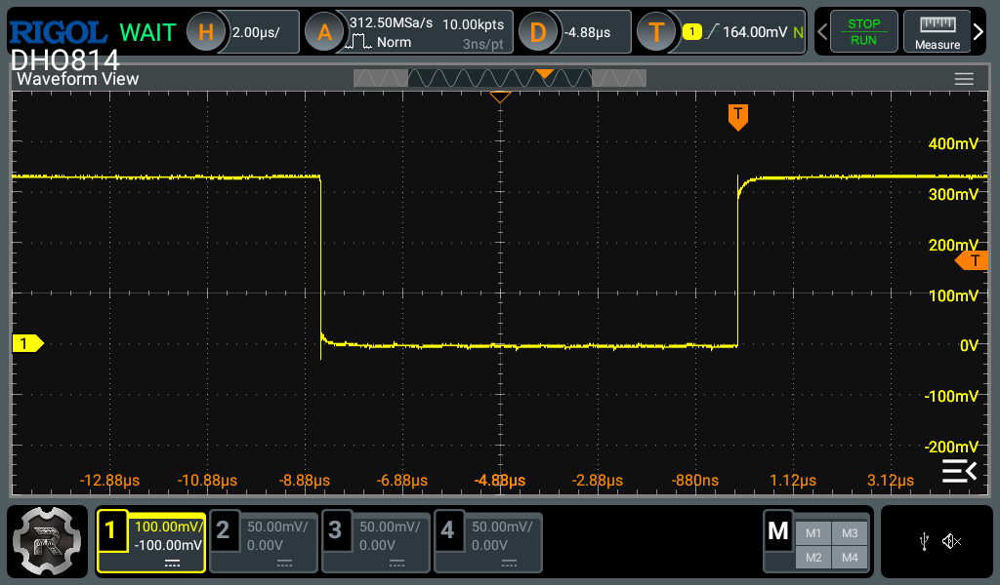
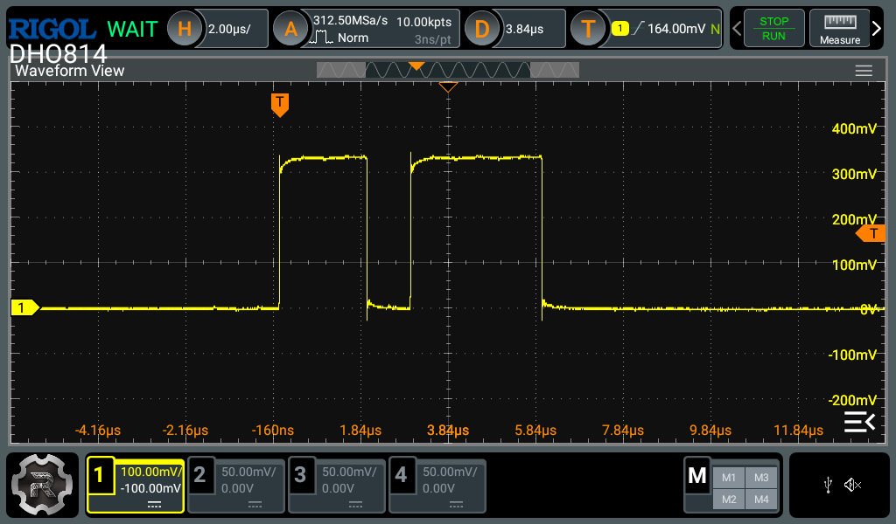

## PWM + SPI demo

PWM on PMOD0

SPI on PMOD 1 to 4:

```
_spi_extension = [ ("spi", 0,
  Subsignal("clk",  Pins("PMOD:1")),
  Subsignal("mosi", Pins("PMOD:2")),
  Subsignal("miso", Pins("PMOD:3")),
  Subsignal("cs_n", Pins("PMOD:4")),
)]
```







When executing ``spi w 55``:



After synthesis, see ``build/olimex_gatemate_a1_evb/gateware/*ccf`` for pin assignment.

After synthesis, see ``build/olimex_gatemate_a1_evb/software/include/generated/csr.h``
for register location and associated functions.
